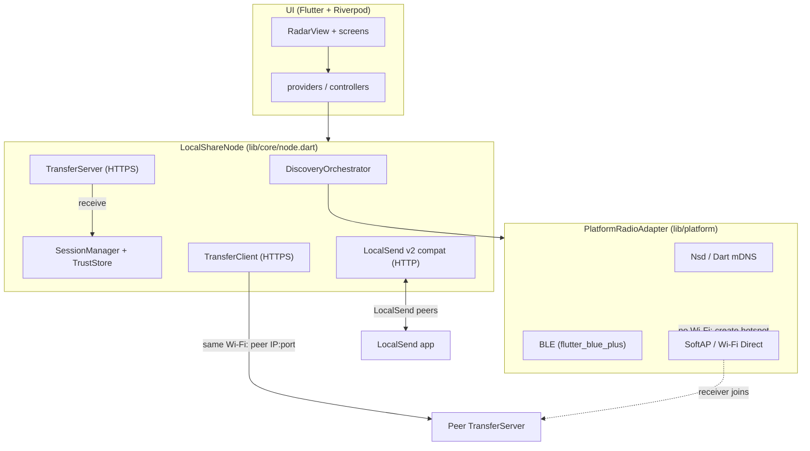
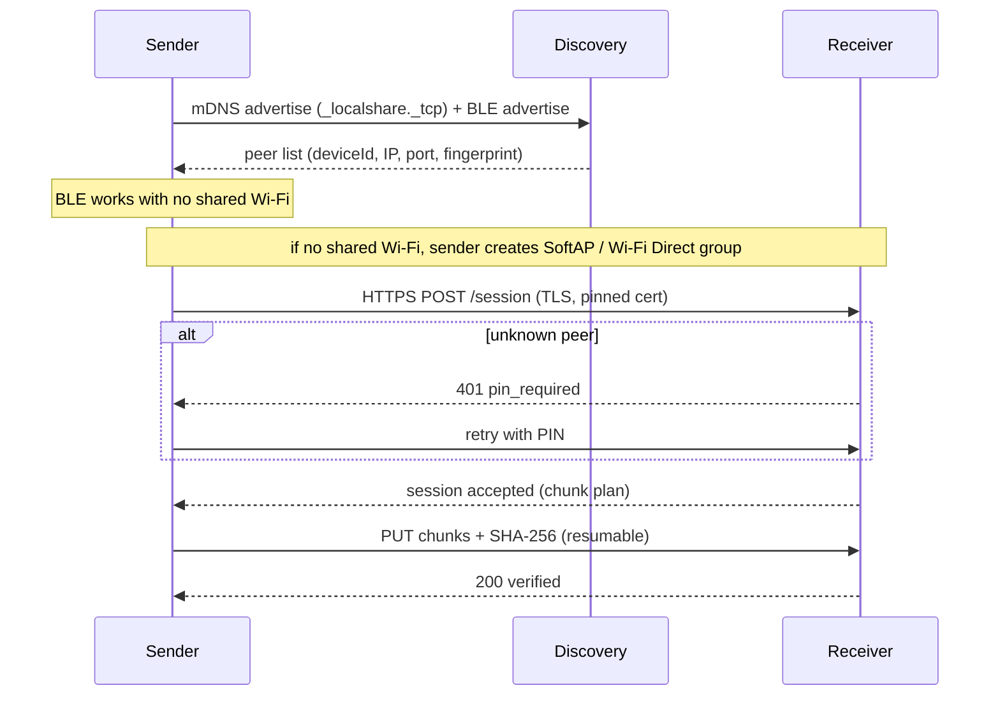
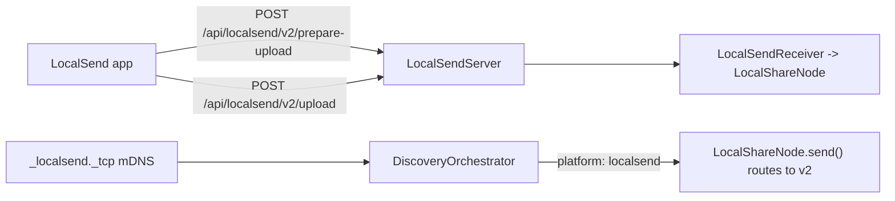

# LocalShare

Serverless, cross-platform local file sharing — an AirDrop / Quick Share /
LocalSend-style app built with Flutter. Devices find each other over your local
network and transfer files directly. No accounts, no cloud, no third-party
internet servers.

Runs on **Android** (phone/tablet), **Android TV**, **iOS**, **Windows**,
**macOS** and **Linux**.

## Highlights

- **Zero-config discovery** — mDNS/DNS-SD (`_localshare._tcp`) plus BLE
  advertising/scanning for devices not on the same Wi-Fi.
- **Direct P2P transfer** — a local HTTPS server/client on a dynamic port, with
  chunked uploads, streaming SHA-256 verification and resume for interrupted
  transfers.
- **Encrypted by default** — an ephemeral self-signed TLS certificate per
  session, pinned by fingerprint (TOFU trust store).
- **PIN pairing** — unknown peers get a short PIN challenge before a transfer is
  accepted.
- **LocalSend v2 interop** — optionally speaks the open LocalSend v2.2 protocol,
  so LocalShare can exchange files with LocalSend apps on the same network.
- **Polished adaptive UI** — an animated radar on phones/TV, multi-column layout
  with drag-and-drop and keyboard/remote navigation on desktop/TV, live progress
  with speed and ETA.

## Architecture



### Discovery and connection layers



### LocalSend interop

LocalSend peers cannot satisfy our pinned-certificate TLS handshake, so a
separate plain-HTTP listener speaks LocalSend protocol v2.2:



`LocalShareNode.send()` inspects the peer platform and routes LocalSend peers
through the v2 client automatically (including the PIN retry flow), so the UI
needs no special-casing.

## Project layout

```
lib/
  core/                      pure Dart engine (no Flutter imports)
    crypto/                  ephemeral TLS cert, SHA-256, PIN
    protocol/                wire models, service type, DeviceInfo
    transport/               HTTPS server/client, chunking, resume, progress
    discovery/               DiscoveryOrchestrator (mDNS + BLE merge)
    session/                 trust store, pairing manager
    interop/localsend/       LocalSend v2.2 models/receiver/sender/server/discovery
    node.dart                LocalShareNode facade
  platform/                  RadioAdapter impls + per-platform selection
  ui/                        Riverpod providers, RadarView, screens, widgets
test/                        unit + real-socket end-to-end tests
packaging/                   linux/ windows/ macos/ distributable scripts
tools/                       icon generator
```

## Build and run

```bash
flutter pub get
flutter analyze              # must be clean
flutter test                 # unit + end-to-end tests
flutter run -d linux         # or windows / macos / android / ios
```

### Packaging distributables

```bash
# Linux: .deb (and .AppImage if appimagetool is on PATH)
./packaging/linux/build.sh

# macOS: .app + .dmg (run on a Mac; optional CODESIGN_IDENTITY to sign)
./packaging/macos/build.sh

# Windows: Inno Setup installer (run in PowerShell)
pwsh ./packaging/windows/build.ps1
```

Regenerate the app icon set with `python3 tools/make_icons.py`.

## Platform notes

- `nsd` has no Linux backend; Linux uses the pure-Dart mDNS client.
- BLE is gated to Android/iOS/macOS/Windows (`flutter_blue_plus` needs BlueZ on
  Linux, which crashes without a system bus).
- Modern Android can't set SoftAP SSID/passphrase programmatically; LocalShare
  reads the system-generated credentials. iOS can never create a SoftAP.
- Android TV: Leanback launcher entry and D-pad navigation are enabled.

## Security

- Per-session ephemeral self-signed certificate; identity pinned by fingerprint.
- Trust-on-first-use store; unknown peers must pass a PIN challenge.
- Streaming SHA-256 integrity check after transfer.
- No data leaves the local network; no internet permission is requested on
  Android.
